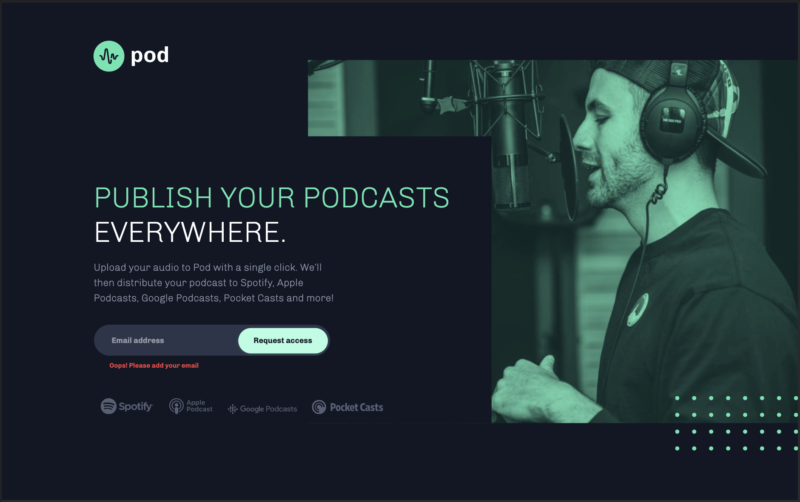

# Frontend Mentor - Pod request access landing page solution

This is a solution to the [Pod request access landing page challenge on Frontend Mentor](https://www.frontendmentor.io/challenges/pod-request-access-landing-page-eyTmdkLSG). Frontend Mentor challenges help you improve your coding skills by building realistic projects. 

## Table of contents

- [Overview](#overview)
  - [The challenge](#the-challenge)
  - [Screenshot](#screenshot)
  - [Links](#links)
- [My process](#my-process)
  - [Built with](#built-with)
  - [What I learned](#what-i-learned)
  - [Continued development](#continued-development)
  - [Useful resources](#useful-resources)
- [Author](#author)

## Overview

### The challenge

Users should be able to:

- View the optimal layout depending on their device's screen size
- See hover states for interactive elements
- Receive an error message when the form is submitted if:
  - The `Email address` field is empty should show "Oops! Please add your email"
  - The email is not formatted correctly should show "Oops! Please check your email"

### Screenshot

### Links

- Solution URL: [Frontend Mentor](https://your-solution-url.com)
- Live Site URL: [GitHub Pages](https://brendanmadden.github.io/pod-request-access-landing-page/)

## My process

### Built with

- Semantic HTML5 markup
- CSS custom properties
- Flexbox
- CSS Grid
- JavaScript

### What I learned

This project tested me on a few different levels. I learned a few new things throughout this one, including Client-side form validation using JavaScript, and custom styling of form error messages. I also continued to learn how to use CSS Grid and Flexbox more effectively. I was able to more easily layout this project than I was projects in the past, and I would like to continue to build on this moving forward. 

### Continued development

After completing this project, I realize that I still have a lot of work to do to ensure that I'm creating layouts that are responsive at all screen sizes, while limiting my use of media queries. I know that there are techniques and properties that will help me to achieve this that I just don't know or remember to use yet. I plan on working through the CSS Tricks flexbox and grid complete guides so that I have a better understanding of every tool and property available. Once I have a better grasp of everything that is out there, I hope that I'll remember to use them in the best places moving forward on my projects. 

### Useful resources

- [Pixel to REM Converter](https://nekocalc.com/px-to-rem-converter) - This is an awesome resource I use for quickly converting different measurements. 
- [Client-side form validation](https://developer.mozilla.org/en-US/docs/Learn/Forms/Form_validation#validating_forms_using_javascript) - This resource was invaluable while learning to implement custom form validation with JavaScript for this project. It was my first time implementing something like this for a project, and I used this resource to guide me through. 

## Author

- GitHub - [Brendan Madden](https://github.com/brendanmadden)
- Frontend Mentor - [@brendanmadden](https://www.frontendmentor.io/profile/brendanmadden)
- Twitter - [@BrendanMadden\_](https://www.twitter.com/BrendanMadden_)